# Phase 2.1 Build Log: vCenter 7.0 Deployment & Troubleshooting

## Document Overview
This log outlines the deployment process, architectural decisions, and troubleshooting steps taken to successfully deploy a VMware vCenter Server Appliance (vCSA) 7.0 to manage the Project Fortress ESXi host. The deployment required resolving ESXi GUI limitations, host time-drift issues, and strict DNS/certificate resolution requirements during Stage 2 initialization.

---

## 1. Architectural Strategy & Initial Setup

**Initial Design Choice:** IP Address vs. FQDN

In enterprise environments with highly available clustered DNS, using an FQDN for the vCenter Primary Network Identifier (PNID) is standard. Because this lab relies on a Ubiquiti UDM-Pro as a single point of failure (SPOF) for upstream DNS, the initial strategy was to use the static IP address (`192.168.0.13`) as the vCenter System Name to reduce dependency on local DNS availability.

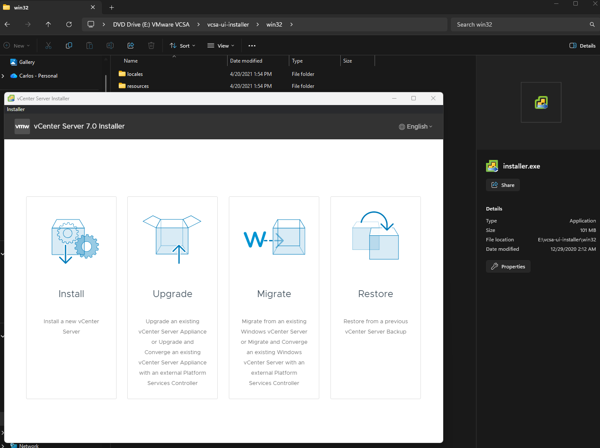
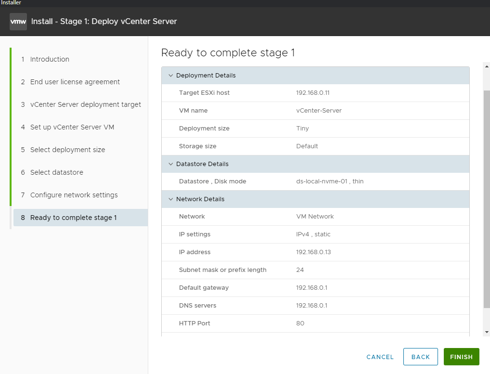
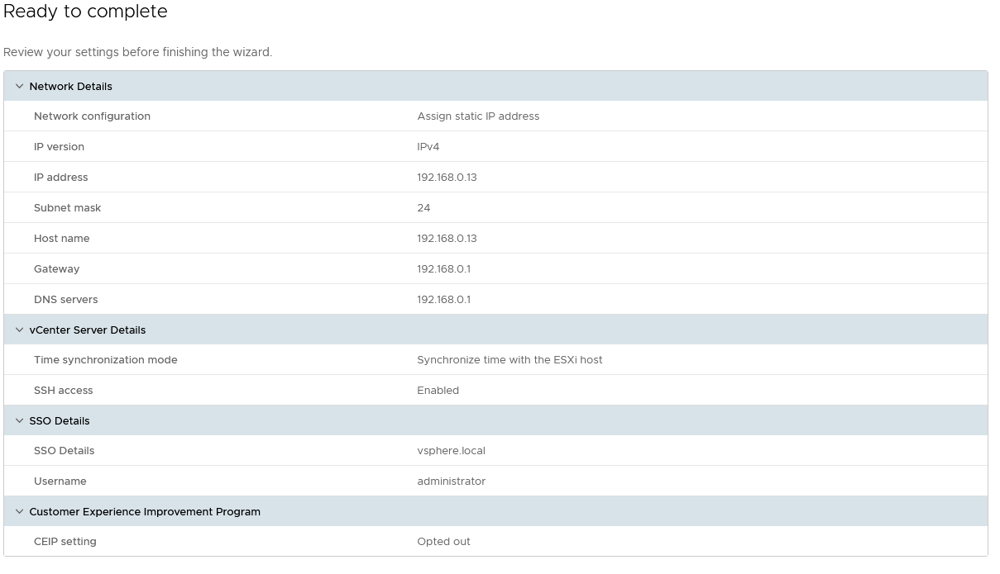

---

## 2. Incident 1: Stage 2 Failure & NTP Synchronization

**Symptom:**  
During the first deployment attempt, Stage 2 failed. The observed behavior was consistent with time drift between the ESXi host and the vCenter appliance, which can interfere with certificate initialization during deployment.

**Complication:**  
Attempting to configure NTP via the ESXi Web GUI failed due to an unresponsive **Actions** menu.

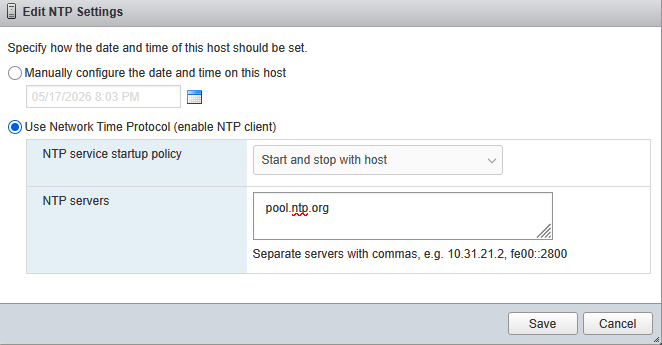

**Resolution: CLI Intervention**

1. Enabled Secure Shell (SSH) on the ESXi host.
2. Connected to the host via PuTTY as `root`.
3. Manually attached the NTP server, enabled the NTP service, and started the daemon.
4. Verified host time synchronization by executing the `date` command.
5. Deleted the corrupted vCenter VM from the datastore before redeployment.

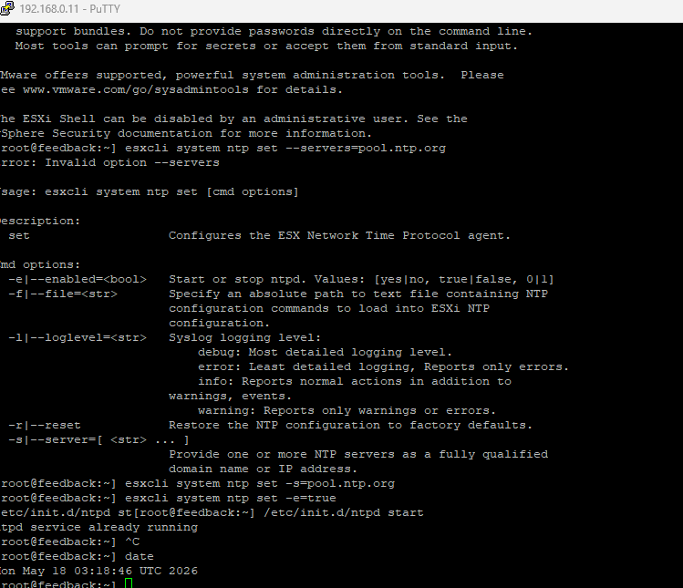

**Security Note:**  
SSH access was used as a controlled troubleshooting method during deployment and should be disabled or restricted after remediation.

---

## 3. Incident 2: Stage 2 Crash at 28% — Service Control Agent

**Symptom:**  
On the second deployment attempt, Stage 2 consistently crashed at approximately 28%. The web-based GUI log viewer was unresponsive.

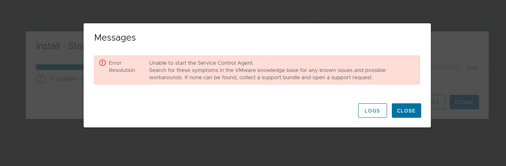

**Troubleshooting via SSH**

1. Connected to the partially deployed vCenter appliance via PuTTY as `root`.
2. Investigated the deployment logs. Initial log checks indicated the installation halted while initializing `scaservice.jar`.

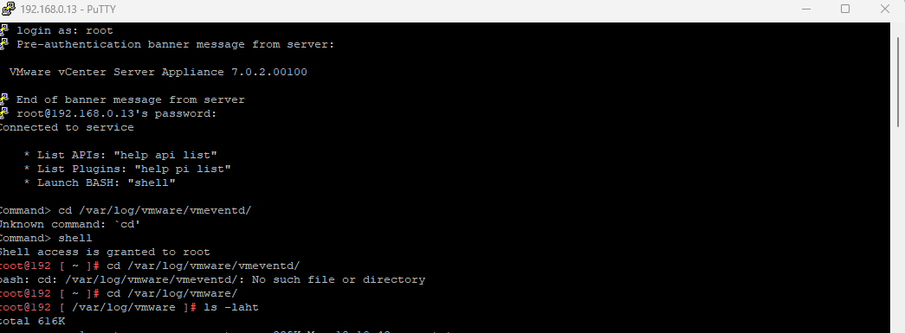

3. Ran a targeted string-match command to pull the exact crash context:

   ```bash
   grep -i -C 5 "exception" /var/log/vmware/sca/sca.log | tail -n 30
   ```

**Root Cause Identified:**  
The logs revealed an issue connecting with the Security Token Service (STS) on port `1080`:

```text
Error communicating to the remote server http://localhost:1080/sts/system-STSService/
ClientTransportException: The server sent HTTP status code 503: Service Unavailable
```

**Analysis:**  
Despite using an IP address for the PNID, the internal vCenter proxy required successful local name resolution during first-boot certificate and service initialization. Without a reliable DNS record resolving the vCenter identity, STS initialization timed out and returned a `503 Service Unavailable` error.


---

## 4. Final Solution & Successful Deployment

To satisfy vCenter name-resolution requirements while maintaining network stability, a local DNS record was configured on the upstream UDM-Pro.

### Network Configuration — UDM-Pro

1. Assigned a fixed IP to the vCenter MAC address: `192.168.0.13`.
2. Created a local DNS record mapping `vcenter.home` to `192.168.0.13`.
3. Verified the internal DNS mapping from a Windows workstation using CMD.

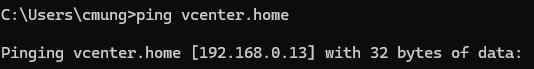

### Attempt 3 Deployment Settings

1. Removed the failed vCenter VM from the datastore.
2. Re-ran Stage 1 using the newly resolvable FQDN: `vcenter.home`.
3. Initialized Stage 2 via:

   ```text
   https://vcenter.home:5480
   ```

**Result:**  
With local DNS resolution functioning correctly, the STS certificate and service initialization process completed successfully. Stage 2 passed the 28% threshold and the vCenter deployment completed.

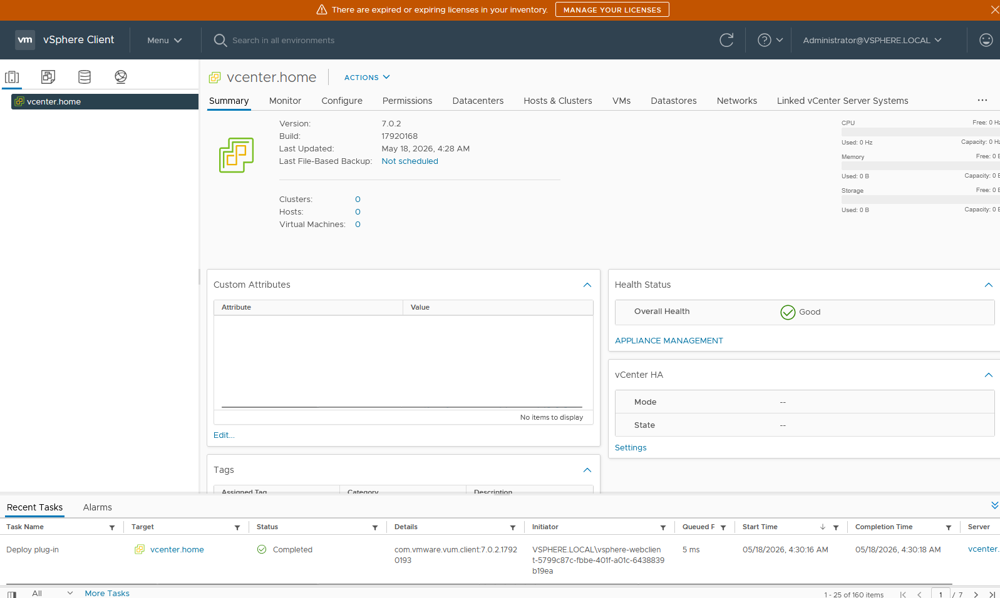


---

## 5. Environment Integration & Licensing

With vCenter online, the foundational ESXi host was adopted into the centralized management plane.

### Configuration Actions

1. Created the `Fortress-DC` Datacenter object.
2. Attached ESXi host `192.168.0.11`.

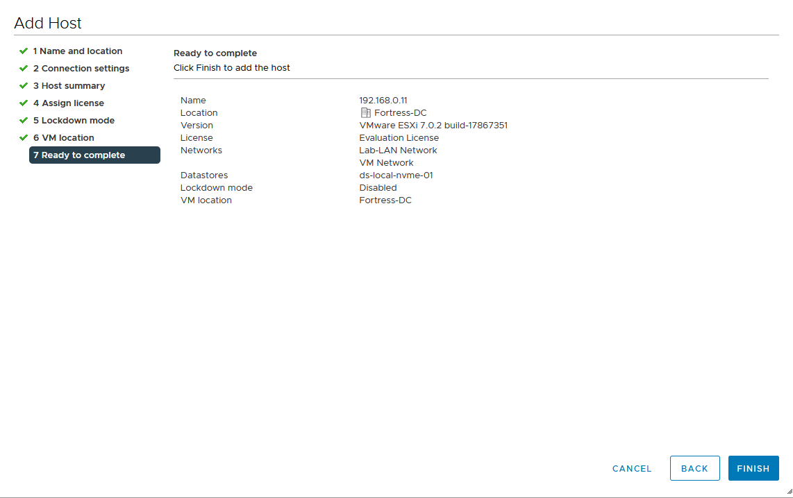

3. Applied vSphere 7 Enterprise Plus licensing to the ESXi host.
4. Applied vCenter 7 Standard licensing to the vCenter appliance.

**Operational Value:**  
This phase established centralized management for the virtualization environment and created the foundation for future clustering, lifecycle management, backup, and recovery workflows.

---

## 6. Disaster Recovery: VAMI Automated Backup

To protect management-plane configuration data, automated vCenter database and configuration backups were routed to a local Unraid NAS via SMB.

### Configuration Details

* **Target:** Unraid NAS SMB Share — `smb://192.168.0.10/vCenter_Backups`
* **Schedule:** Daily at 11:00 AM UTC
* **Retention:** Rolling 7 days
* **Scope:** Stats, Events, Tasks, Inventory, and Configuration

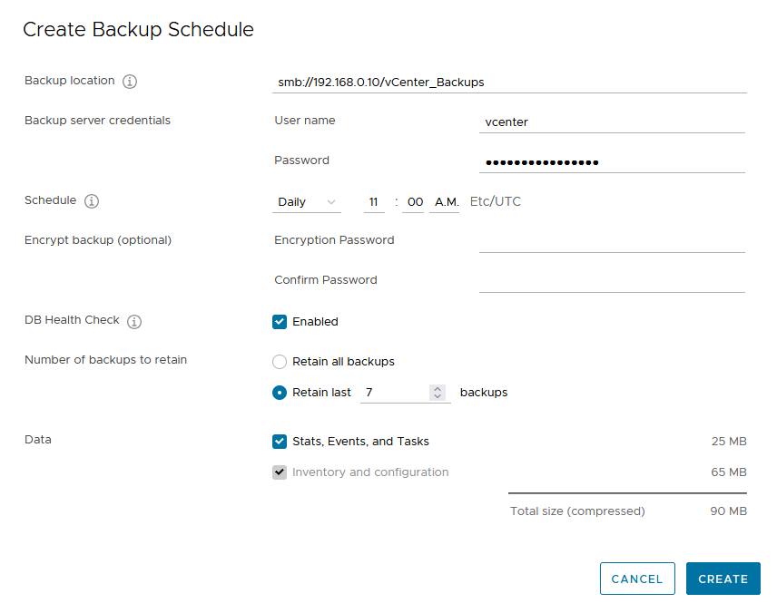
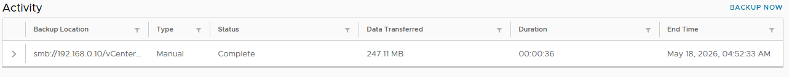

**Operational Value:**  
This backup workflow improves management-plane resilience by preserving vCenter configuration and inventory data for future recovery testing.

---

## Phase 2.1 Status

**Complete and verified.**
