# Phase 2.2: Infrastructure Automation & Pre-Migration Backup

## Objective
Automate virtual machine provisioning via VMware PowerCLI, construct a reusable Windows Server 2019 Golden Image, and secure the vCenter control plane using Veeam Backup & Replication prior to initiating physical network migrations.

## Infrastructure Stabilization (Hardware)
* **Issue:** The ESXi host experienced intermittent crashing under load. Diagnosed as unstable facility power delivery / voltage fluctuation.
* **Resolution:** Implemented a UPS with Automatic Voltage Regulation (AVR). Uptime validation confirmed system stability under full load over a 4-day period, clearing the way for production-like lab workloads.

---

## 1. Automated VM Provisioning & Golden Image Creation
To standardize Windows Server deployments, a base VM was provisioned entirely via CLI and converted into a vCenter template.

**Template Note:** The Windows Server 2019 golden image currently supports infrastructure roles such as Veeam, utility servers, and future AD DS deployment. Newer Windows Server templates may be added later as part of lifecycle modernization.

### PowerCLI Installation & Authentication
Installed the `VMware.PowerCLI` module on the main admin workstation, accepted the PSGallery trust prompt, and established a connection to the vCenter appliance (`vcenter.home`) using a documented lab-only certificate validation exception. 

*Future hardening will replace the self-signed certificate exception with a trusted internal certificate chain.*

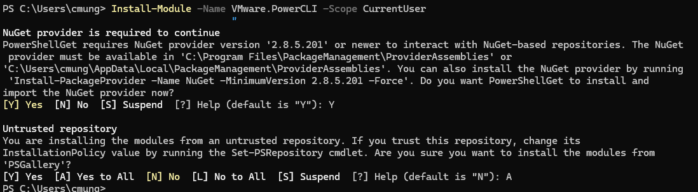
*Fig 1.1: Initializing the VMware.PowerCLI module installation.*

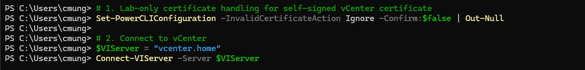
*Fig 1.2: Connecting to vCenter via PowerCLI.*

### Automated Base VM Provisioning
Executed an automated deployment script to provision the `Win2019-Template-Base` VM with customized vCPU, memory, and thin-provisioned disk settings. Explicitly configured the network adapter type as `VMXNET3`, VMware’s paravirtualized network adapter commonly used for higher-performance virtualized workloads.

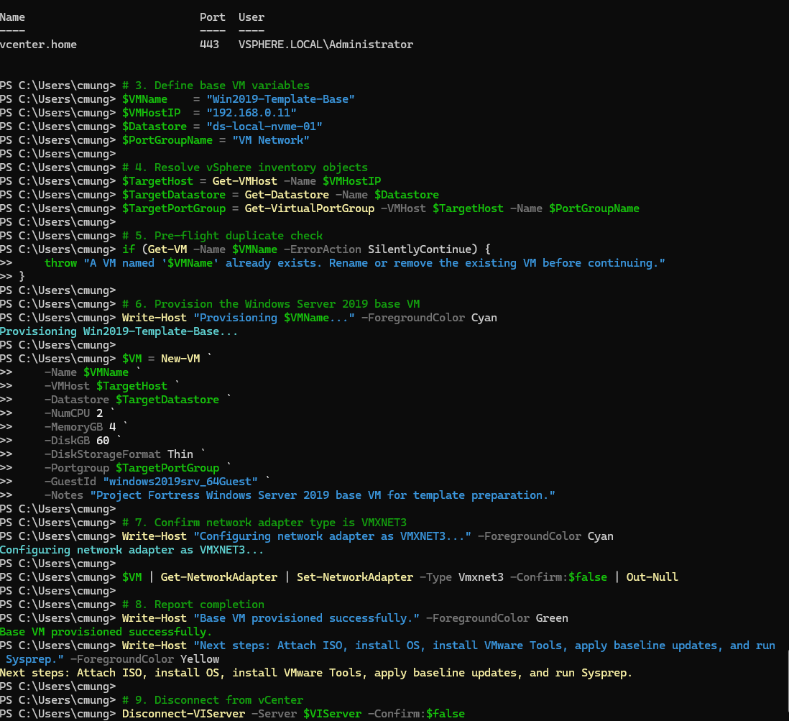
*Fig 1.3: Script execution showing pre-flight checks, variable assignment, and successful VMXNET3 provisioning.*

### OS Initialization & Sysprep
Installed Windows Server 2019, deployed VMware Tools, and applied all cumulative Windows Updates. Executed the Windows System Preparation Tool (Sysprep) to strip unique hardware identifiers and SIDs before converting the VM into a vSphere Template.

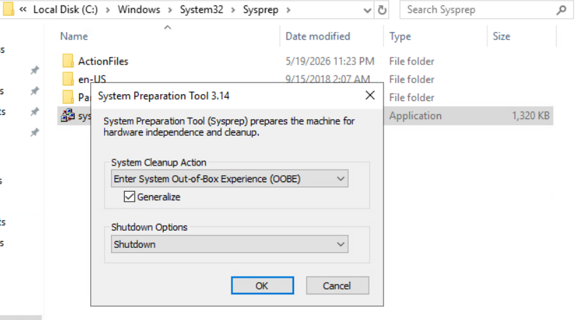
*Fig 1.4: Executing Sysprep with 'Generalize' to sanitize the Golden Image.*

---

## 2. Veeam Backup & Replication Deployment
Deployed the backup infrastructure from the newly created Golden Image to secure the datacenter prior to Phase 3 routing changes.

### Deploying the Veeam Server from Template
Deployed `Veeam-Server` from the `Win2019-Template-Base` template, increasing storage and CPU allotment for the backup role. Assigned static IP `192.168.0.14`.

**Migration Note:** `192.168.0.14` is a pre-migration staging address. During Phase 3 VLAN implementation, the Veeam server will be moved into the logically isolated Backup & Recovery segment.

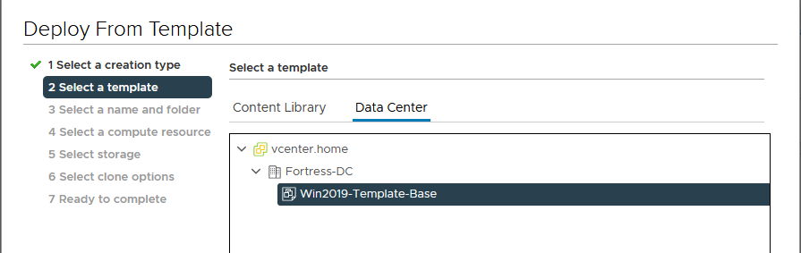
*Fig 2.1: Selecting the sanitized Golden Image from the vCenter content library.*

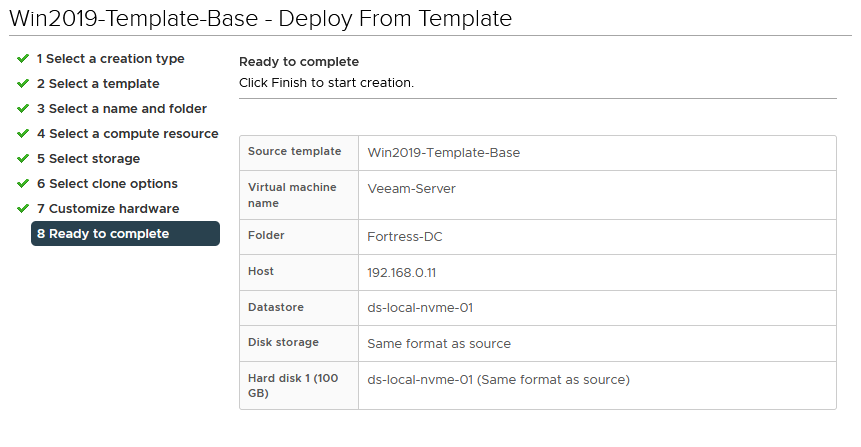
*Fig 2.2: Provisioning summary for the new Veeam-Server VM.*

### Security Hardening & Software Installation
The Veeam server is explicitly excluded from future domain-join operations. It resides in a standalone workgroup (`VBR-ISLAND`) to protect the backup console from potential Active Directory credential compromises. Installed Veeam Backup & Replication Community Edition.

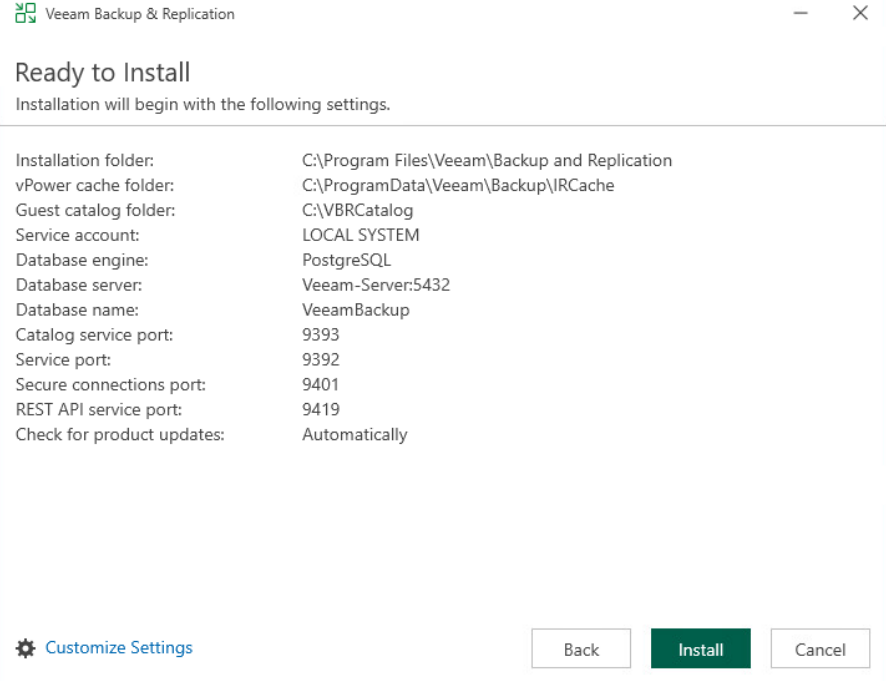
*Fig 2.3: Veeam Backup & Replication installation dependencies and service ports.*

Temporarily disabled IE Enhanced Security Configuration (ESC) during installation to complete administrative setup, documented as a lab-only exception. Pointed the backup console to `localhost` to ensure the UI remains resilient to future IP and subnet migrations planned for Phase 3.

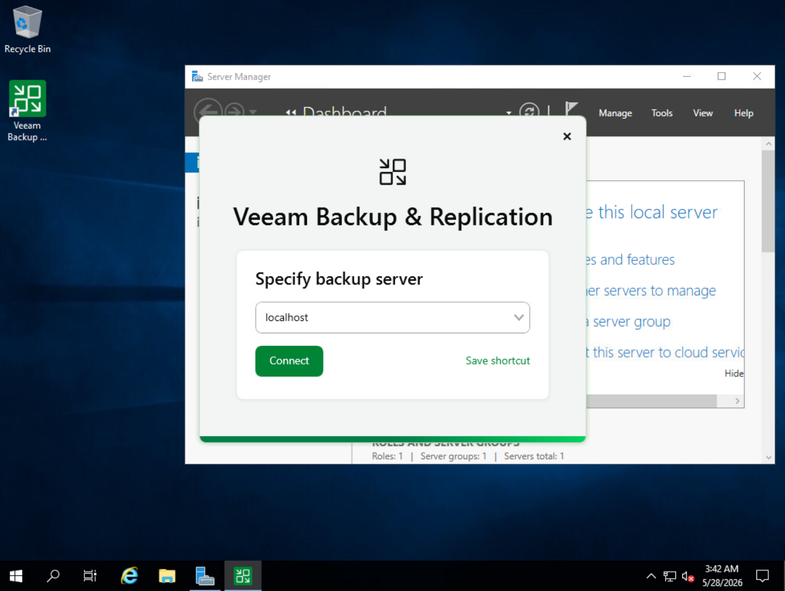
*Fig 2.4: Connecting the VBR Console to the local backup engine.*

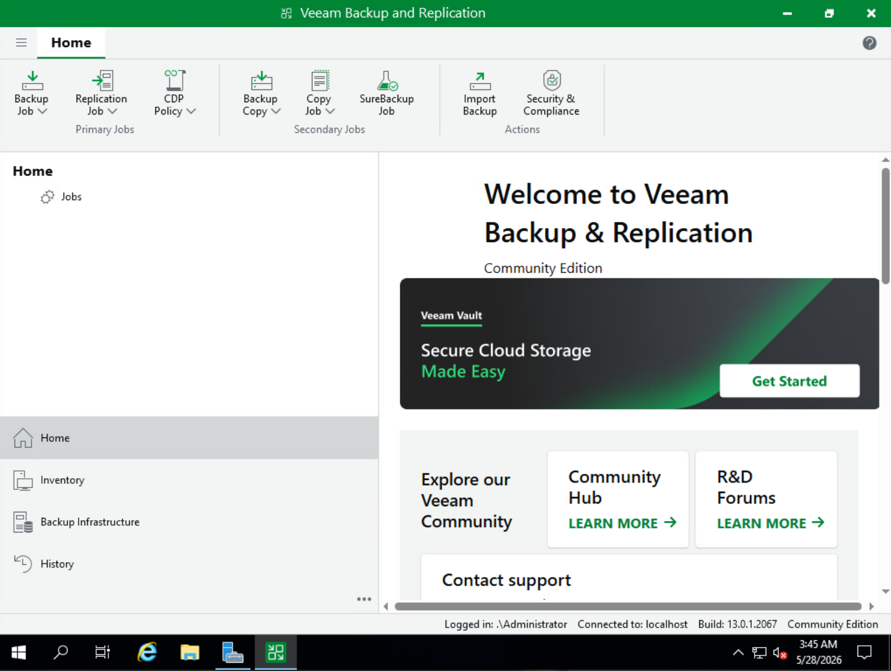
*Fig 2.5: Successful initialization of the Veeam Backup interface.*

---

## 3. Pre-Migration Disaster Recovery Validation
Configured baseline backup protection for the vCenter management plane prior to Phase 3 physical routing and VLAN migration.

### Infrastructure Mapping (Source & Target)
* **Source:** Added the vCenter Server Appliance to Veeam managed infrastructure using administrative credentials.
* **Target:** Mapped the Unraid NAS (`192.168.0.10`) via SMB as the primary Veeam backup repository.
* **Configuration Backup:** Configured Veeam to back up its own configuration database to the secondary NAS target.

**Recovery Path Note:** Because vCenter is part of the protected management plane, Phase 2.2 recovery planning should also document direct ESXi host access for restoring the vCenter appliance if vCenter itself is unavailable.

**Restore Validation Scope:** Phase 2.2 confirms successful backup creation and repository connectivity. Full disaster-recovery validation will require a documented restore test, including direct ESXi access, vCenter appliance recovery steps, and verification that the restored appliance can re-establish management-plane visibility.

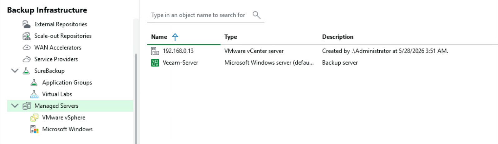
*Fig 3.1: vCenter Appliance successfully adopted into Veeam inventory.*

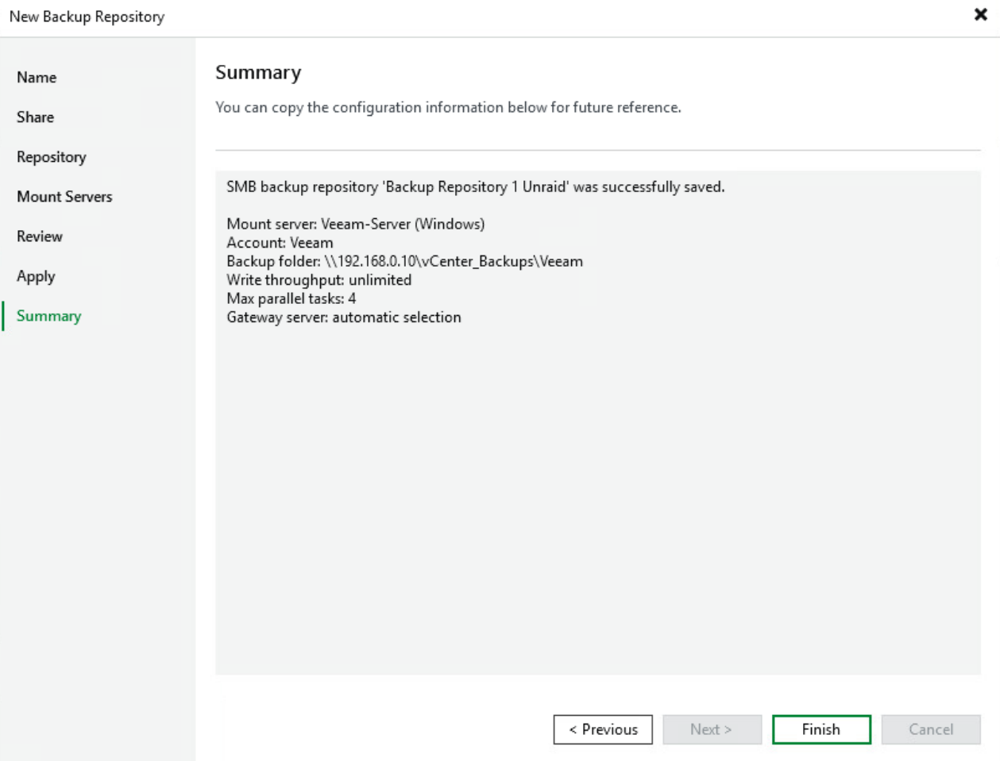
*Fig 3.2: Mapping the Unraid NAS SMB share as the backup target.*

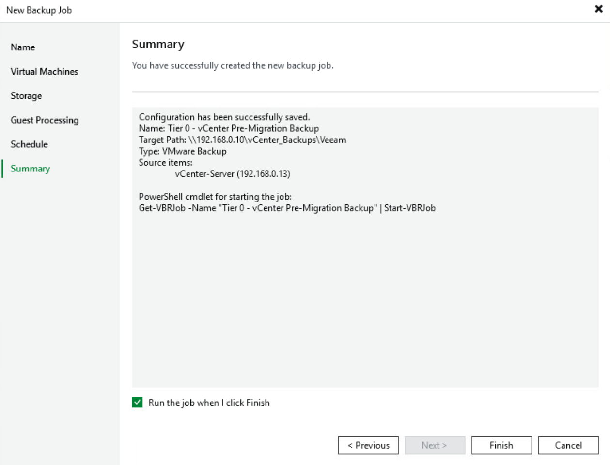
*Fig 3.3: Pointing the VBR configuration backup to the secondary NAS target.*

### Execution & Telemetry
* **Execution:** Successfully executed a full image-level backup of the vCenter Server Appliance to the Unraid NAS, confirming backup job completion and repository connectivity. 
* **Telemetry:** Veeam reported target-side bottlenecking during the job, providing useful baseline performance data for future repository and network tuning.
* **Next Validation Step:** Perform a restore test or recovery verification to confirm the backup can be used during a management-plane failure or network migration rollback.

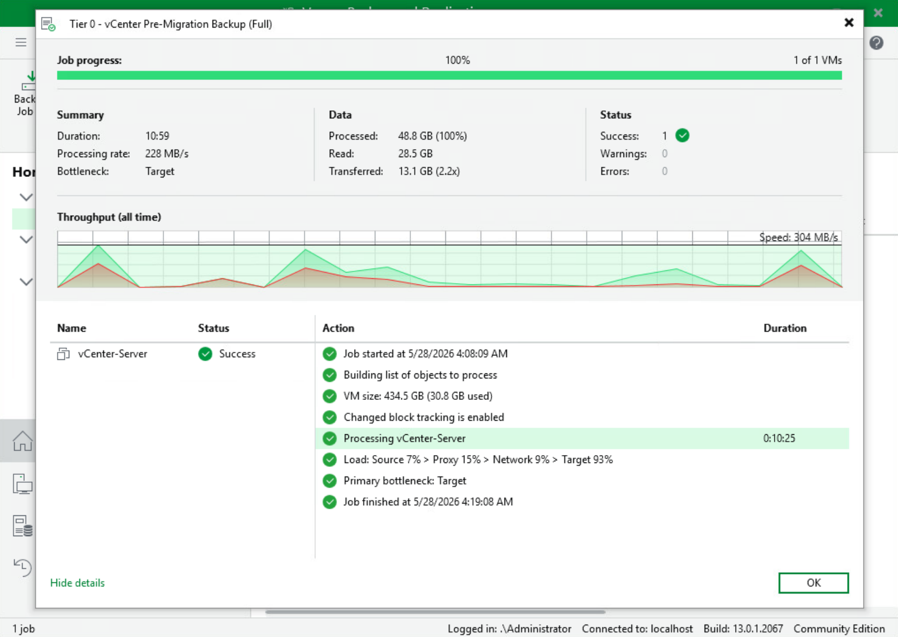
*Fig 3.4: Job configuration for the Tier 0 Pre-Migration Backup.*

*Fig 3.5: 100% job success with target-side bottleneck reporting, confirming backup completion and repository throughput visibility.*

---

## Operational Lessons Learned
* Hardware stability must be validated before deploying production-like services.
* Golden images reduce configuration drift and improve deployment repeatability.
* Backup infrastructure should remain outside the primary AD trust boundary where practical.
* Management-plane backups should be completed before major routing or VLAN changes.
* Restore validation is required before backup coverage can be considered fully operational.
