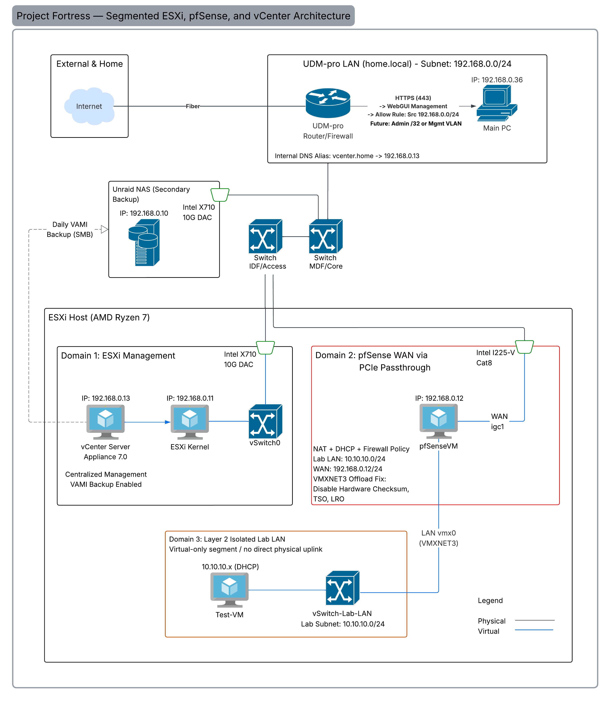

# Project Fortress: Enterprise Systems & Security Operations Lab

## Overview
Project Fortress is an enterprise systems and security operations lab built on VMware ESXi and consumer-grade AMD Ryzen hardware. The project demonstrates virtual firewall deployment, segmented lab networking, PCIe NIC passthrough, centralized management, and controlled routing between the lab LAN and the upstream home network.

The primary objective is to establish a pfSense-governed lab segment at `10.10.10.0/24` for future security tooling, SIEM deployment, Windows/AD testing, and endpoint telemetry validation, centrally managed through a licensed vSphere/vCenter environment.

## Architecture

### Management Plane Integration (Phase 2.1)
The environment is centrally managed by a VMware vCenter Server Appliance (vCSA) 7.0. An internal DNS alias was configured on the upstream Ubiquiti UDM-Pro to satisfy vCenter PNID, SSO, and certificate name-resolution requirements during deployment.

The ESXi host is licensed for vSphere 7 Enterprise Plus features, enabling future expansion into clustering, vMotion, and more advanced lifecycle management as additional hosts are added. vCenter appliance configuration and database backups are scheduled daily to a secondary Unraid NAS target via SMB.

This phase establishes centralized management, improves operational visibility, and creates the foundation for future backup, recovery, and controlled access workflows.

### Dedicated WAN Interface via PCIe Passthrough
Due to consumer motherboard ACS limitations, the lab uses a documented ESXi passthrough compatibility setting (`VMkernel.Boot.disableACSCheck=true`) to assign a physical Intel I225-V NIC directly to the pfSense VM. This creates a dedicated WAN path for the virtual firewall while keeping ESXi management and lab workload traffic separated into distinct network domains.

**Risk Note:** This ACS-related passthrough setting is documented as a lab-only compatibility configuration. Because it may reduce hardware-enforced PCIe device isolation, it is treated as an accepted lab risk and should not be considered a production-grade isolation control.

* **Domain 1: ESXi Management Plane:** Intel X710 10G DAC (Managed via vCenter `192.168.0.13`)
* **Domain 2: pfSense WAN Path:** PCIe-passthrough Intel I225-V
* **Domain 3: Lab LAN Segment:** Layer 2 Virtual `vSwitch-Lab-LAN` connected to pfSense LAN

## Hardware Specifications
* **Compute:** ASUS ROG Strix / AMD Ryzen 7 5800X (8-Core)
* **Memory:** 64GB DDR4
* **Networking (Physical):** Intel X710 10G DAC, Dual Intel I225-V 2.5G
* **Upstream Router / DNS:** Ubiquiti UDM-Pro
* **Backup Storage:** Secondary Unraid NAS Target

## Current Security Posture
* Lab workloads are separated from ESXi management traffic.
* The lab LAN has no direct physical uplink and routes through pfSense policy.
* pfSense provides DHCP, NAT, and firewall control for the `10.10.10.0/24` segment.
* vCenter provides centralized visibility and management for the ESXi host.
* Management-plane DNS and NTP dependencies are documented and validated.
* SSH access is documented as a temporary troubleshooting control and should be disabled or restricted after remediation.
* vCenter appliance backups are scheduled daily to a secondary NAS target, with restore validation planned for Phase 2.2.

## Build Logs
* [Phase 1 Build Log: Perimeter Foundation](BUILD_LOG_PHASE_1.md)
* [Phase 2.1 Build Log: vCenter Deployment & Troubleshooting](BUILD_LOG_PHASE_2.1.md)

## Completed Milestones

### Phase 1: Perimeter Foundation
Established the pfSense-governed `10.10.10.0/24` lab segment using PCIe NIC passthrough, a Layer 2 isolated ESXi vSwitch, DHCP, NAT, and routing validation. This phase created the segmented network boundary used for future security tooling, SIEM, Windows/AD, and endpoint telemetry testing.

### Phase 2.1: Centralized Management
Deployed vCenter 7.0, resolved DNS/NTP/certificate initialization issues, adopted the ESXi host into centralized management, and configured daily VAMI backups to a secondary Unraid NAS target.

## Project Roadmap
- [x] **Phase 1: Perimeter Foundation** (Hardware Passthrough, pfSense Deployment, Segmented Boundary).
- [x] **Phase 2.1: Centralized Management** (vCenter 7.0 Deployment, Internal DNS Alias, ESXi Host Adoption).
- [ ] **Phase 2.2: Disaster Recovery** (Veeam Backup & Replication Architecture).
- [ ] **Phase 3: Controlled Remote Access** (WireGuard VPN, collaborator access controls).
- [ ] **Phase 4: Tool Provisioning** (Security tooling, Splunk/ELK, Windows AD Environment).
